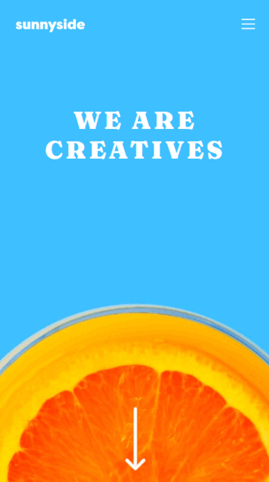

# Frontend Mentor - Agency landing page solution

This is a solution to the [Agency landing page challenge on Frontend Mentor](https://www.frontendmentor.io/challenges/sunnyside-agency-landing-page-7yVs3B6ef).  

## Table of contents

- [Overview](#overview)
  - [The challenge](#the-challenge)
  - [Screenshot](#screenshot)
  - [Links](#links)
- [My process](#my-process)
  - [Built with](#built-with)
- [Contacts](#contacts)

## Overview

### The challenge

Users should be able to:

- View the optimal layout for the site depending on their device's screen size
- See hover states for all interactive elements on the page

### Screenshot

### Links

- Repository URL: [https://github.com/lucavergallo/Agency-Landing-page](https://github.com/lucavergallo/Agency-Landing-page)
- Live Site URL: [https://agency-landing-page-luca-vergallo.netlify.app/](https://agency-landing-page-luca-vergallo.netlify.app/)

## My process

### Built with

- Semantic HTML5 markup
- CSS custom properties
- Flexbox
- CSS Grid
- Mobile-first workflow
- JavaScript

### Contacts

Luca Vergallo

- LinkedIn: [https://www.linkedin.com/in/luca-vergallo/](https://www.linkedin.com/in/luca-vergallo/)
- Email: l.vergallo@hotmail.it

